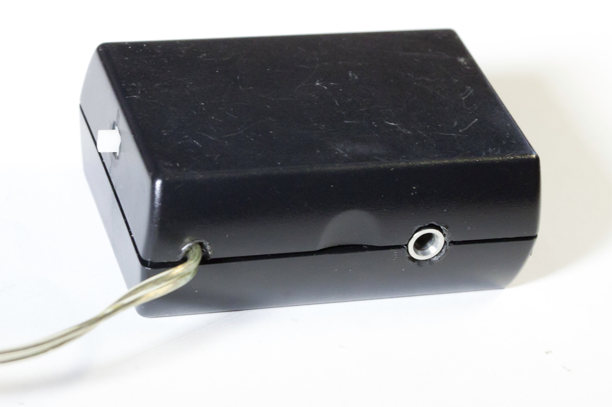

# (very messy) sources for ultrasound directional speaker

> [YOUTUBE: A pocket-sized directional speaker](https://youtu.be/tj980NAlydM) done by my student Vlad Orlov

I've never intended to put the sources online, but since many people asked, here we go.

The circuit was "post-adjusted" for 75V, I'm not sure about any other modifications. Pay attention at the inductor in series with ultrasound speakers (value may need to be adjusted). When connecting speakers, mind polarity.

[PCB files (492 KB zip file)](UltrasoundPCB2011.zip)

The working device looked like that:

The version before modifications (excuse my student for messy soldering --- it was his first time):

The original (un-modified) scheme curcuit:

